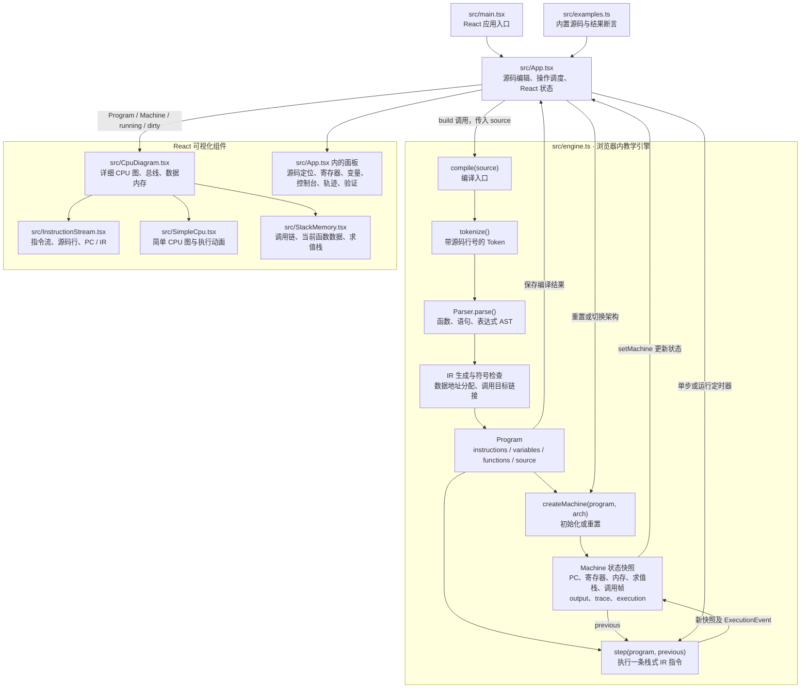

# CPU Observatory · CPU 观测站

可静态部署的 CPU 教学可视化网页。编写 C++ 子集程序，通过编译、单步和连续运行观察指令、寄存器、内存和数据通路。

**在线体验：[CPU 观测站](https://chinadongnet.github.io/cpu-eye-gpt6/)**

**更新记录：[CHANGELOG.md](CHANGELOG.md)**。网页顶部版本按钮与侧栏“更新”可直接查看同一份记录。

## 版本与更新约定

每次更新递增最小版本位（patch），例如 `1.0.1 → 1.0.2`。以最新 main 为基准，一个 PR 的多次修订共用一个版本；合并前确认没有与其他更新冲突。

```bash
npm run version:patch
```

该命令同步 package.json 与 package-lock.json，不创建提交或标签。随后在 CHANGELOG.md 顶部新增版本、实际日期和改动摘要，保留既有历史。页面直接读取 package.json 和 CHANGELOG.md，避免手工维护重复内容。

```bash
npm run check:release
npm run build
```

构建自动检查版本一致性与更新日志。面向 main 的 PR 还会检查补丁版本恰好增加 1。提交规范见 [AGENTS.md](AGENTS.md)。

## 本地启动

环境：Node.js 20.19+ 或 22.12+，npm。

```bash
npm install
npm run dev
```

打开终端显示的地址（默认 `http://localhost:5173`）。

## 已实现功能

- x86（32 位）、x86-64、ARM32、ARM64 教学模型切换。
- C++ 编辑器、语法高亮、当前源码行与指令联动、源代码下载。
- 编译、运行/暂停、单步、重置，1 / 4 / 12 / 30 / 120 条指令每秒。
- 通用寄存器 HEX / DEC 显示、变化高亮、简化状态标志与数据通路。
- 动态 CPU 示意图：统一指令流、PC、IR、控制单元、寄存器组、ALU、MAR/MDR、数据存储器和地址/数据/控制总线，支持放大查看。
- 变量、数组、小端内存字节、解释器求值栈。
- 标准输出、最近 160 条执行轨迹、原始示例预期结果验证。
- 累加求和、斐波那契、冒泡排序、最大公约数、位运算、类与对象成员六个示例。
- 除零、数组越界、移位范围、语法错误诊断与 100,000 条指令运行上限。
- 中文界面，桌面和手机自适应布局。

## 使用流程

桌面视口宽度 ≥ 1100px 且高度 ≥ 680px 时自动启用**单屏工作台**：顶部固定执行工具栏，上层统一为指令流 → CPU → 函数栈，下层为源码、寄存器状态以及变量 / 控制台。指令只在一处展示，完整列表支持独立滚动与自动跟随；源码在执行时自动跟随当前行，编辑期间保留手动滚动位置。CPU 图和编辑器均可展开，按 Escape 恢复。平板使用双列工作区，手机使用纵向布局，避免过度压缩内容。

1. 选择 CPU 架构及示例。
2. 点击“单步”观察变化，或“运行”连续执行；绿色 PC 标记**下一条**指令，紫色 IR 标记最近执行的指令。
3. 查看寄存器高亮、内存写入、源码行和执行轨迹。
4. 程序完成后进入“结果验证”，核对示例变量、输出和返回值。
5. 修改代码后点击“编译”，也可按 `Ctrl / Cmd + Enter`。运行按钮会自动编译修改。

切换架构会重置当前执行状态。切换示例会替换源码；有自定义修改时会提示。源代码可下载保存，刷新页面恢复默认示例。

### 观察 CPU 示意图

工具栏下方的 CPU 示意图随单步和连续执行同步更新：

- **简单 / 详细模型**：右上角随时切换；简单模型突出 CPU 当前操作、PC、IR 和 SP，详细模型保留控制单元、寄存器组、ALU 和总线。切换只改变展示，不重置程序或暂停执行。
- **执行视图**：左侧为统一的指令流，中间为 CPU，右侧默认 Stack Memory，也可切换为数据内存。
- **函数调用帧**：显示调用链、当前函数入口、返回目标、参数和局部变量/数组/对象成员的实际数据地址、数值和字节；写入高亮并自动跟随访问位置。main 返回后保留最终快照。
- **临时求值栈**：展示 SP、每个槽的地址和值、栈顶、增长方向及占用字节；32 位模型每槽 4 B，64 位每槽 8 B。单步中可观察入栈和出栈。

- **指令流**：集中展示完整程序的指令地址、架构风格汇编、C++ 行号和 PC / IR 状态；分支跳转与展开 / 恢复布局后自动跟随执行位置。修改源码后提示仍在展示上次编译的快照。
- **PC / IR**：PC 指向下一条取指地址，IR 保留刚执行的指令、该指令地址和 C++ 行号；程序停止时明确标注状态。
- **控制单元与 ALU**：高亮传送、运算、分支或输出操作，展示运算前的真实操作数 A/B、操作符及结果。
- **MAR / MDR 与 RAM**：LOAD / STORE 时显示实际访问地址、数据、读写方向，并自动定位变量、数组元素或对象成员的内存字节。
- **总线与分支**：蓝色表示地址/取指，绿色表示数据，紫色表示控制；分支显示目标地址、是否跳转以及实际 PC 更新。
- 点击右上角展开图示，按 Escape 退出；窄屏可在图内横向滚动。暂停保留本次快照，重置或切换模型清空执行快照。

图示由引擎的结构化执行事件驱动；每次单步仍是一条完整教学指令。连线展示该步参与的组件，不表示真实流水线或分阶段时序。MAR/MDR 展示当前指令的访存事件，无访存时显示空闲。源码修改后，图示标明仍在展示上次编译状态。

函数栈视图展示解释器实际维护的调用链与当前函数数据，以有厚度的堆叠卡片展示数据槽：绿色参数和局部变量采用 `0x1000` 起的真实模拟数据地址，紫色临时求值栈从 `0x8000` 向下增长，两者分区显示。求值栈按高地址到低地址排列，标出栈底、SP 和栈顶，随执行增减层数并自动跟随栈顶。CALL 保存返回目标和调用方求值栈边界，参数通过求值栈逐项写入被调函数的数据区，RET 将结果交还调用方。返回地址作为调用帧元数据单独保存，不占用求值栈槽位或改变 SP。各函数使用编译期分配的独立固定数据区，每次调用重新置零；入口即展示当前函数全部局部数据。这是非递归教学调用模型，不代表原生 C++ ABI 或原生调用栈布局。

## 支持的语言范围

以下范围按 [src/engine.ts](src/engine.ts) 的实际解析与执行规则整理。适合整数算法、循环、数组、非递归函数调用和基础对象成员的教学演示。

### 已支持

| 类别 | 支持范围 |
| --- | --- |
| 程序入口 | `int main()`、`int main(void)`；main 没有显式 return 时返回 0 |
| 普通函数 | **返回类型为 int**；int / bool 按值参数、无参函数、嵌套调用、重复调用、提前返回 |
| 函数调用位置 | 初始化、赋值、条件、运算、数组下标、输出、return，以及独立的 `func();` 语句 |
| 变量 | 函数内的 int / bool；例如 `int x;`、`int x = 3;`；支持 true / false |
| 数组 | 一维固定长度数组，长度为 **1–128 的整数字面量**；下标读写、整数表达式初始化列表 |
| 赋值 | `=`、`+=`、`-=`、`*=`、`/=` |
| 自增自减 | 独立的后置语句 `i++;`、`i--;`，以及 for 更新部分 |
| 运算 | 算术、比较、逻辑、位运算、移位、一元正负、括号及运算符优先级；逻辑与/或支持短路 |
| 控制流 | `if / else`、`else if`、`while`、初始化/条件/更新三部分完整的 for |
| 基础类与结构体 | 使用前在顶层定义 class / struct；int / bool 数据成员、成员数组、多个独立对象、public 成员读写 |
| 对象声明与访问 | `A a;`、`A a{};`、`a.x`、`a.data[i]`；识别 public/private/protected 并检查访问权限 |
| 输出 | `std::cout << 整数表达式`，支持链式输出；也接受 cout、std::endl / endl |
| 其他 | 行注释、块注释、顶层 `using namespace std;`；预处理行仅忽略 |

支持的运算符：`+ - * / %`、`== != < > <= >=`、`&& || !`、`& | ^ ~ << >>`，以及一元 `+ -`。

示例：

```cpp
#include <iostream>

int main() {
    int sum = 0;
    for (int i = 1; i <= 10; i++) {
        sum += i;
    }
    std::cout << sum << std::endl;
    return 0;
}
```

局部变量每条声明一个；类/结构体中的数据成员允许 `int x, y;`。其他语义差异见下文“与标准 C/C++ 的差异”。

### 普通函数

```cpp
int func(int x, int y)
{
    return x + y;
}

int main() {
    return func(1, 2);
}
```

此程序从 main 开始执行，按值传入 1 和 2，最终返回 3。单步可观察参数求值、CALL（ARM 显示为 BL）、参数写入、加法及 RET。参数按从左到右的教学顺序求值；不同函数的参数和局部数据互不干扰，返回后保留调用方尚未完成的表达式。

函数定义可放在 main 前后，编译器统一链接；这比原生 C++ 对前置声明的要求更宽松。变量和内存列表用 `func::x` 区分被调函数的数据，main 中仍保留 `x` 等原始名称；调用帧内显示局部名。函数结束后数据内存保留最近一次调用的快照，再次调用时重新置零。非 main 函数执行到末尾却未返回整数会报告运行错误，main 隐式返回 0。当前不支持函数原型、重载、递归（含间接递归）、void 返回类型以及数组、对象、指针或引用参数。

### 基础类与对象

```cpp
class A {
public:
    int x;
    int y;
};

int main() {
    A a;
    a.x = 1;
    a.y = 2;
    return 0;
}
```

支持 `A a;` / `A a{};`，多个独立对象、`int` / `bool` 数据成员及固定长度成员数组、成员读写和表达式、复合赋值及后置自增/自减。类内可写 `int x, y;`。`class` 默认 private，`struct` 默认 public，识别 public/private/protected 标签并检查普通函数中的成员访问权限。

成员按声明顺序展开为 `a.x`、`a.y` 等独立存储项，出现在指令、变量、内存和写入高亮中。示例中地址分别为 `0x1000`、`0x1004`。每个成员元素占 4 字节，包括 bool；空对象预留 4 字节但没有可展示成员。这是教学布局，不模拟原生 C++ ABI。对象成员与其他变量一样默认置零，区别于原生 C++ 未初始化成员的语义。

### 当前不支持

| 类别 | 不支持的内容 |
| --- | --- |
| 其他类型 | char、short、long、unsigned、float、double、字符/字符串字面量、枚举等 |
| 声明形式 | 全局变量、static、const、auto、typedef；局部一次声明多个变量，如 `int a, b;` |
| 初始化形式 | `int x(3);`、`int x{3};` 等直接初始化；对象的非空初始化列表 |
| 函数特性 | **递归及间接递归**、函数原型、重载、默认参数、可变参数、函数指针、Lambda |
| 函数类型 | void / bool 等非 int 返回类型；数组、对象、指针、引用参数 |
| 指针与动态内存 | 指针、引用、取地址、解引用、new/delete、malloc/free |
| 数组扩展 | 多维数组、变长数组、自动推导长度 `int a[] = {...};`、对象数组 |
| 类的高级特性 | 成员函数、构造/析构、继承、多态、嵌套对象、对象复制、类内成员初始化 |
| 控制流扩展 | break、continue、switch、do/while、goto、范围 for、省略子句的 `for(;;)` |
| 表达式扩展 | `?:`、逗号表达式、赋值表达式、类型转换、sizeof、`%=` 和位运算复合赋值 |
| 自增表达式 | `++i`、`--i`、`int x = i++;`、`return i++;` |
| 一般表达式语句 | `1 + 2;`、空语句 `;`；独立函数调用语句可以使用 |
| 输入和标准库 | cin、printf/scanf、文件操作、STL、vector、string、标准库算法等 |
| 其他语言与工程能力 | 自定义 namespace、模板、异常处理、宏展开、条件编译、实际加载头文件、多文件编译和链接 |

几个容易混淆的写法：

```cpp
i++;                    // 支持：独立后置自增
int x = i++;            // 不支持：将自增作为表达式

int a = 1;
int b = 2;              // 支持：分别声明
int a = 1, b = 2;       // 不支持：局部多变量声明

struct A { int x, y; }; // 支持：类/结构体内可声明多个数据成员
A a;                    // 支持：通过类型名声明对象
struct A a;             // 不支持：这种 C 风格声明写法
```

上述片段用于对比语法，不能作为一个完整程序直接运行。

### 与标准 C/C++ 的差异

- **函数内是平坦作用域**：不同函数可有同名参数或局部变量；同一函数内，即使位于不同 `{}` 中，也不能重复声明同名变量。块内声明在后续编译的语句中仍可见，未提供块级作用域。
- **未初始化数据默认置零**：包括局部变量和对象成员；被调函数每次进入时重新初始化其独立数据区。
- **bool 暂时按 int 存储和运算**：不执行原生 bool 转换；`bool b = 7; return b;` 的结果是 7。
- **int 始终为有符号 32 位**：选择 64 位 CPU 模型也不改变 int 宽度；溢出按补码截断。
- **整数字面量范围为 0–2147483647**：支持十进制和十六进制，负数由一元负号构成。直接写 `-2147483648` 也会被拒绝，因为先检查正数字面量；二进制、八进制的原生字面量语义及整数后缀不在支持范围内。
- **函数定义可放在调用之后**：编译器统一链接，不要求原生 C++ 的前置声明；参数固定从左到右求值。
- **缺少返回值会报错**：非 main 函数执行到末尾而未返回整数时报告运行错误；main 隐式返回 0。
- **预处理行仅忽略**：`#include` 不加载头文件，`#define` 不定义宏，`#if` 不控制代码是否参与编译；cout 是内置输出处理。
- **输出为整数事件**：cout 不提供完整流语义，endl 被接受但不保留原生输出流的换行格式。
- **类型检查仍有宽松之处**：实测数组名直接用于整数表达式会取首元素（如 `int a[2] = {3, 4}; return a;` 返回 3），标量的 `a[0]` 也会被接受。这些是当前实现的宽松行为，不能作为标准 C/C++ 合法性的判定，也不表示支持数组到指针转换。

### 运行限制与诊断

| 项目 | 限制或行为 |
| --- | --- |
| 源码长度 | 最多 30,000 字符 |
| 数组长度 | 每个数组 1–128 项，须使用整数字面量 |
| 模拟数据区 | 全部函数的参数、变量、数组和对象存储合计最多 4 KiB |
| 执行预算 | 每次最多 100,000 条教学指令 |
| 移位 | 位数须在 0–31 内 |
| 运行错误 | 数组越界、除零、非法移位、缺少函数返回值或超出执行预算时停止 |
| 编译诊断 | 包括语法错误、未声明变量、未定义函数、参数数量不匹配、重复声明、成员访问权限及递归调用 |

## 技术架构与编译入口

### 哪个文件负责编译？

**用户输入的 C++ 子集代码由 [src/engine.ts](src/engine.ts) 中的 `compile(source: string): Program` 编译。** 词法分析器 `tokenize()`、语法分析器 `Parser`、IR 生成、符号检查、模拟数据地址分配和函数调用目标链接都在这个文件中。

页面上的“编译”按钮和 Ctrl / Cmd + Enter 调用 [src/App.tsx](src/App.tsx) 的 `build()`，再调用 `compile(source)`；成功后保存 Program，并通过 `createMachine(program, arch)` 初始化机器状态。编辑器的 `Highlight` 仅用于语法着色。

项目使用 **React 19 + TypeScript + Vite 6**。`npm run build` 执行发布检查、TypeScript 类型检查和 Vite 网页打包，生成 `dist/` 静态资源；用户代码的编译与执行发生在浏览器中的教学引擎内。两者各自处理网页工程和编辑器内的 C++ 源码。

### 技术架构图

下图为实际模块及数据流，GitHub 可直接渲染 Mermaid：



`ExecutionEvent` 保存在 `Machine.execution` 中，包含本步指令、执行前后 PC、操作数、结果，以及可选的内存访问、分支和错误信息。组件读取实际执行快照来更新高亮与连线。`instructionText(instruction, arch)` 将 IR 映射为架构风格的展示文本；切换架构继续复用同一份 Program。

### 编译与执行职责

| 位置 | 职责 |
| --- | --- |
| `src/engine.ts` → `tokenize()` | 扫描标识符、数字、运算符和分隔符，保留行号，跳过注释和预处理行 |
| `src/engine.ts` → `Parser` | 解析顶层类与函数、参数、语句和表达式，形成 AST；通过优先级处理表达式 |
| `src/engine.ts` → `compile()` | 按函数管理符号，展开对象成员，分配数据地址，生成栈式 IR，填充分支和调用目标，拒绝递归调用；main 的入口保持为首条指令 |
| `src/engine.ts` → `createMachine()` | 创建寄存器、数据内存、空求值栈及 main 调用帧 |
| `src/engine.ts` → `step()` | 执行一条 IR，处理运算、访存、跳转、CALL / RET、输出和错误，返回新 Machine 快照 |
| `src/engine.ts` → `run()` | 从初始机器开始反复调用 step 直到停止，供引擎测试等场景使用 |
| `src/engine.ts` → `architectures` / `instructionText()` | 定义模型寄存器名称与位宽，生成教学汇编文本 |
| `src/App.tsx` → `build()` / `singleStep()` / `play()` | 连接编辑器与引擎；页面连续运行由定时器逐次调用 step，便于观察和暂停 |
| `src/examples.ts` → `validateExample()` | 对原始内置示例的变量、输出和返回值进行预期断言 |

IR 包括 `CONST / LOAD / STORE`、`BINARY / UNARY`、`JZ / JMP`、`CALL / RET`、`DROP / DUP`、`PRINT / HALT`。表达式通过求值栈传递操作数；函数调用通过独立调用帧记录返回目标和调用方的求值栈边界。

## CPU 模型边界

执行链路：`C++ 源码 → 词法/语法分析 → AST → 栈式 IR → 单步解释执行 → React 可视化`。

本项目是**教学级模拟器**，未接入 Clang、QEMU 或原生机器码编译执行。四种模型共用 IR 执行语义，区别在于架构风格的汇编展示、寄存器命名、32/64 位显示和求值栈槽位宽度。

- 汇编列表为伪指令映射，包含 `CMP.EQ`、`OUT` 等教学操作，不可直接交给真实汇编器。
- 指令地址固定每条递增 4 字节，包括 x86。PC 起始 `0x400000`，变量起始 `0x1000`，求值栈起始 `0x8000`。
- int 数据始终为有符号 32 位；溢出按补码截断，区别于原生 C++ 有符号溢出语义。所有模型使用小端内存展示。
- 主寄存器展示结果，第二寄存器展示二元运算右操作数，第三寄存器展示最近访问地址；求值操作数由解释器栈保存。这是简化分配，不模拟 ABI。
- Z/N/C/V 为教学标志，由解释器统一更新，不宣称符合各 ISA 的真实标志位规则。
- 求值栈是解释器临时操作数栈；计数是教学指令条数；数据通路显示最近操作所属组件。
- 不模拟真实 CPU 周期、缓存、流水线、分支预测、异常级别、系统调用或操作系统。
- 自定义程序显示实际输出与状态；自动预期断言仅绑定未修改的内置示例。

## 验证

```bash
npm test
npm run build
```

引擎测试涵盖六个示例与普通函数调用在四种架构中的结果、参数传递/嵌套调用/函数作用域、对象实例隔离、成员布局/访问控制/高亮、状态快照、逻辑短路、表达式优先级、溢出、错误处理和死循环预算。

浏览器集成测试：

```bash
npx playwright install chromium
npm run test:e2e
```

测试覆盖实际页面上的单步、连续运行、验证、架构切换、自定义编译、函数调用链/参数/返回值、类成员赋值与字节布局、错误恢复、内存视图和移动端布局。

已有 Chrome / Edge 时，也可设置环境变量 `PLAYWRIGHT_CHANNEL=chrome` 或 `msedge` 使用本机浏览器，免下载 Chromium。

## 网页部署

本仓库已配置 GitHub Pages 自动部署：推送到 `main` 后，`.github/workflows/deploy-pages.yml` 自动安装依赖、运行引擎测试、构建并发布网页。也可在 GitHub Actions 的 **Deploy GitHub Pages** 页面手动触发。部署记录可在仓库的 Actions 页面查看。

在线地址：<https://chinadongnet.github.io/cpu-eye-gpt6/>。

本地构建与预览：

```bash
npm run build
npm run preview
```

生产文件输出到 `dist/`，可直接部署到任何静态网站托管服务：

| 平台 | 配置 |
| --- | --- |
| Vercel / Netlify / Cloudflare Pages | 构建命令 `npm run build`；输出目录 `dist` |
| GitHub Pages | 在 CI 中安装依赖并构建，将 `dist` 作为 Pages artifact 发布 |
| Nginx / Apache / 对象存储网站 | 上传 `dist/` 内全部文件并启用静态 HTTP 服务 |

Vite 已设置 `base: './'`，支持子路径部署。无后端、数据库或 API Key。请使用 HTTP 服务访问，不直接双击 `index.html`。字体通过 Google Fonts 增强，离线时自动回退系统字体，执行功能不依赖外部网络。

## 代码结构

```text
src/main.tsx        React 应用入口
src/engine.ts       解析、编译、CPU 状态、单步执行、汇编映射
src/examples.ts     六个示例与结果断言
src/App.tsx         工作台、源码编辑、编译与运行调度、状态管理
src/CpuDiagram.tsx  CPU 结构、指令/地址/执行快照可视化
src/InstructionStream.tsx  统一指令流、PC / IR 与源码行联动
src/SimpleCpu.tsx   简单 CPU 模型与执行动画
src/StackMemory.tsx 教学调用链、当前函数参数/局部数据和临时求值栈
src/Changelog.tsx   从 CHANGELOG.md 与 package.json 读取更新日志和版本
src/cpu-diagram.css CPU 示意图与总线样式
src/workbench.css   桌面单屏布局、面板滚动与紧凑样式
src/styles.css      主题、动画与响应式布局
tests/engine.test.ts        引擎测试
tests/browser/app.spec.ts  浏览器交互测试
```
